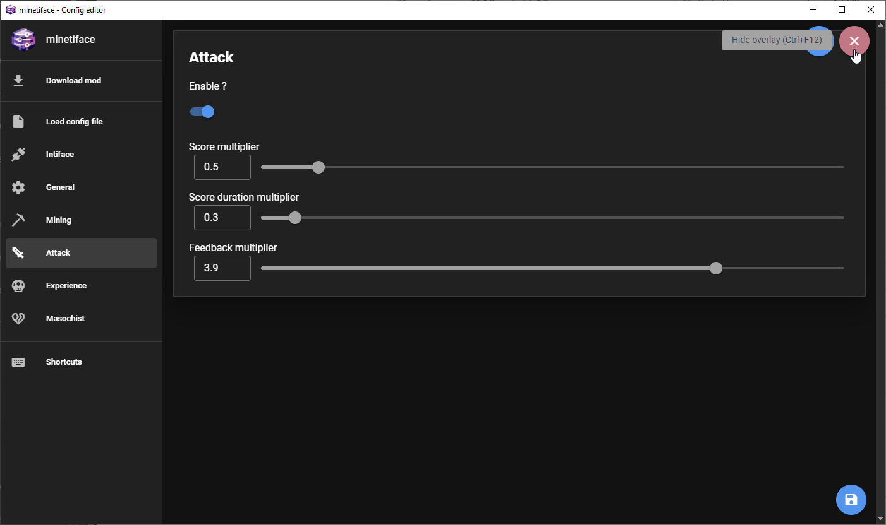

# mInetiface config editor

**mInetiface config editor** is a Tauri application designed to help you configure and download the [mInetiface](https://github.com/Fyustorm/mInetiface) mod. This repository contains the code for the configuration tool.



## Features

- User-friendly interface to download and configure the mInetiface mod.
- Shortcut to show the config editor in-game (for fullscreen it only works in borderless).

## Installation

### Windows

1. Go to the [latest release](https://github.com/Fyustorm/mInetiface-config/releases/latest) page.
2. Download the file `minetiface_{version}_x64-setup.nsis.zip`.
3. Extract the downloaded ZIP file.
4. Run the `minetiface_{version}_x64-setup.exe` file to start the installation process.
5. Follow the on-screen instructions to complete the installation.

### Linux

1. Go to the [latest release](https://github.com/Fyustorm/mInetiface-config/releases/latest) page.
2. Download the file `minetiface_{version}_amd64.AppImage.tar.gz.
3. Extract the downloaded TAR.GZ file:
    ```bash
    tar -xvzf minetiface_{version}_amd64.AppImage.tar.gz
5. Make the AppImage file executable:
   ```bash
   chmod +x minetiface_{version}.AppImage
6. Run the AppImage file to start the application:
   ```bash
    ./minetiface_{version}.AppImage

## Contributing
If you have suggestions for improvements, feel free to open an issue or submit a pull request.
